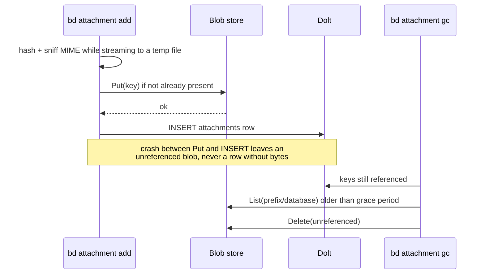

# Issue Attachments in an Object Store: Implementation Plan

> **For Claude:** REQUIRED SUB-SKILL: Use superpowers:executing-plans to implement this plan task-by-task.

**Goal:** Let any bd client attach a file to an issue, list it, fetch it and remove it,
with the bytes in an S3-compatible object store that every machine sharing the Dolt
server can reach.

**Architecture:** bd owns the whole feature. Attachment metadata is a row in a new
`attachments` table, so it versions, syncs and exports with the issue. The bytes live
in a content-addressed blob store behind a small `blobstore.Store` interface with two
backends: `local` (files under `.beads/attachments`, for solo and embedded use) and
`s3` (Hetzner Object Storage, MinIO, AWS). Clients such as b9s never talk to the
bucket or hold its credentials: they read metadata over SQL like any other column and
ask bd for the bytes or for a short-lived presigned URL.

**Tech Stack:** Go, Dolt (MySQL protocol), `aws-sdk-go-v2/service/s3` (already in
`go.mod` as an indirect dependency through Dolt), MinIO in Docker for integration tests.

**Tracking:** Beads epic `bd-t8j5` in the b9s database. Every commit carries
`Refs: bd-t8j5.<n>` for the child task it completes.

---

## Table of contents

- [Why this shape](#why-this-shape)
- [Design](#design)
  - [Data model](#data-model)
  - [Blob keys and dedup](#blob-keys-and-dedup)
  - [Write and delete order](#write-and-delete-order)
  - [Configuration and credentials](#configuration-and-credentials)
  - [CLI surface](#cli-surface)
  - [How b9s uses it](#how-b9s-uses-it)
- [Fork strategy](#fork-strategy)
- [Phase A: beads fork](#phase-a-beads-fork)
  - [Task A1: Rebase upstream PR 4316 onto the fork](#task-a1-rebase-upstream-pr-4316-onto-the-fork)
  - [Task A2: blobstore interface and key scheme](#task-a2-blobstore-interface-and-key-scheme)
  - [Task A3: local backend](#task-a3-local-backend)
  - [Task A4: s3 backend](#task-a4-s3-backend)
  - [Task A5: migration 0068 stores a blob key, not a path](#task-a5-migration-0068-stores-a-blob-key-not-a-path)
  - [Task A6: route bd attachment through the blob store](#task-a6-route-bd-attachment-through-the-blob-store)
  - [Task A7: get, url and gc verbs](#task-a7-get-url-and-gc-verbs)
  - [Task A8: refuse a local backend on a shared server](#task-a8-refuse-a-local-backend-on-a-shared-server)
  - [Task A9: docs](#task-a9-docs)
- [Phase B: infrastructure](#phase-b-infrastructure)
- [Phase C: b9s](#phase-c-b9s)
- [Out of scope](#out-of-scope)

---

## Why this shape

Beads 1.3.0 has no attachments: no command, no table. The only per-issue free-form
fields are `issues.metadata` (JSON) and `issues.external_ref`.

Upstream has an open request (gastownhall/beads#4051) and an open, unreviewed PR
(#4316) that adds `bd attachment add|list|copy|remove|fsck|prune`. It stores metadata
in Dolt and bytes as plain files in `.beads/attachments/<id>/<sha256>`. That works for
one machine. It does not work for us: the shared Dolt server is read by several
laptops, Omnigent lanes and the b9s web image, and a row whose bytes sit on one
laptop is a broken link everywhere else.

Three alternatives were rejected:

| Option | Why not |
|---|---|
| Bytes in a Dolt `LONGBLOB` table | Every file stays in Dolt history for good. Dolt has no way to shrink history, and every clone and backup carries it. |
| Links only (URLs in `metadata`) | No upload path, and each client invents its own storage and credentials. |
| b9s talks to S3 itself | Every client re-implements keys, dedup, credentials and cleanup. The entanglement belongs in bd, the one layer every client already goes through for writes. |

## Design

### Data model

One new table, one row per (issue, content hash):

```sql
CREATE TABLE IF NOT EXISTS attachments (
    id CHAR(36) NOT NULL PRIMARY KEY,
    issue_id VARCHAR(255) NOT NULL,
    hash_algorithm VARCHAR(32) NOT NULL,     -- 'sha256'
    content_hash VARCHAR(128) NOT NULL,      -- hex
    original_filename VARCHAR(1024) NOT NULL,
    mime_type VARCHAR(255) NOT NULL,
    byte_size BIGINT NOT NULL,
    blob_key VARCHAR(1024) NOT NULL,         -- backend-relative, see below
    created_by VARCHAR(255) NOT NULL,
    created_at DATETIME NOT NULL DEFAULT CURRENT_TIMESTAMP,
    INDEX idx_attachments_issue (issue_id),
    INDEX idx_attachments_hash (hash_algorithm, content_hash),
    UNIQUE KEY uniq_attachments_issue_hash (issue_id, hash_algorithm, content_hash),
    CONSTRAINT fk_attachments_issue FOREIGN KEY (issue_id)
        REFERENCES issues(id) ON DELETE CASCADE ON UPDATE CASCADE
);
```

The row never names a bucket, endpoint or backend. Those come from config, so a
project can move from `local` to `s3` (or to another bucket) by copying blobs and
changing config, with no data migration.

### Blob keys and dedup

```
<prefix>/<database>/sha256/<first 2 hex>/<full hex>
e.g.  osenco/b9s/sha256/9f/9f86d081884c7d65...
```

- **Content-addressed per database.** The same screenshot on two issues is one object.
  The key is computed from the bytes, so a retried upload is a no-op.
- **`<prefix>` is the workspace**, matching the Beads credential boundary
  (`docs/beads-workspace-credential-boundary.md` in agents-config): one bucket, one
  prefix per workspace, one S3 key pair scoped to that prefix by bucket policy.
- **`<database>`** is the Dolt database name, so two projects in one workspace never
  share a key space even when their hashes collide by design (same file).

### Write and delete order



- **Add uploads first, then inserts.** A row always has its bytes. An orphan blob is
  harmless and `gc` removes it.
- **Remove deletes the row only.** Deleting the blob inline races with a concurrent add
  of the same file on another machine. `bd attachment gc` deletes blobs that no row
  references and that are older than `attachments.gc-grace` (default 24h).
- **Deleting an issue cascades the rows** through the foreign key. `gc` collects the blobs.

### Configuration and credentials

`config.yaml` (non-secret, committed with the project):

```yaml
attachments:
  backend: s3              # local | s3; default local
  max-bytes: 26214400      # 25 MiB; add refuses larger files
  gc-grace: 24h
  s3:
    endpoint: https://fsn1.your-objectstorage.com
    region: fsn1
    bucket: osenco-beads-attachments
    prefix: osenco         # the workspace
    path-style: false
    url-ttl: 15m           # default expiry for `bd attachment url`
```

Secrets never go in config. bd resolves the key pair in this order:

1. `BEADS_ATTACHMENTS_S3_ACCESS_KEY_ID` and `BEADS_ATTACHMENTS_S3_SECRET_ACCESS_KEY`
   (the workspace `.envrc`, next to `BEADS_DOLT_PASSWORD`).
2. `attachments.s3.credential-command`, run through `internal/creds.CommandSource`,
   the same helper bd uses for `BEADS_DOLT_CREDENTIAL_COMMAND`. It prints
   `{"access_key_id": "...", "secret_access_key": "..."}`.

With neither, `add`, `get`, `url` and `gc` fail with an error naming both options.
`list` and `show` keep working: they read metadata only.

### CLI surface

Upstream's verbs stay, so the fork can go back upstream later. New verbs are marked.

| Command | Does |
|---|---|
| `bd attachment add <id> <file>...` | Upload and record. `--name` overrides the filename. `--json` prints the rows. |
| `bd attachment list <id>` | Hash prefix, name, MIME, size, author, date. `--json`. |
| `bd attachment copy <id> <sel> <target>` | Download to a file or directory. |
| `bd attachment get <id> <sel>` **(new)** | Stream the bytes to stdout. For pipes and b9s. |
| `bd attachment url <id> <sel>` **(new)** | Print a presigned GET URL. `--ttl`. s3 only; `local` prints a `file://` URL. |
| `bd attachment remove <id> <sel>` | Delete the row. |
| `bd attachment gc` **(new, replaces fsck/prune)** | Report and delete unreferenced blobs. `--dry-run` is the default; `--apply` deletes. |
| `bd show <id>` | Lists attachments under the description, like comments. `--json` includes them. |

`<sel>` is an attachment id, a unique hash prefix (min 7) or an exact filename.

### How b9s uses it

```
  b9s TUI / web ──SQL SELECT──▶ attachments table      (list, like comments)
        │
        ├── add:  bd attachment add <id> <path>         (writes always go through bd)
        ├── open (TUI):  bd attachment copy → temp file → open(1)
        └── open (web):  bd attachment url → OSC 8 hyperlink the browser opens
```

b9s never sees the S3 keys. The web image builds bd from this fork and gets the key
pair from its environment like `BEADS_DOLT_PASSWORD`.

## Fork strategy

- `vanderheijden86/beads` is the fork. Its `main` mirrors `gastownhall/beads` main and
  carries no changes of ours. Sync it with `gh repo sync vanderheijden86/beads`.
- The feature lives on `feat/attachments-object-store`, cut from upstream main
  (`511849496` at the time of writing). Local worktree:
  `~/Documents/beads/.worktrees/feat-attachments-object-store`.
- Rebase onto upstream main before each landing, not merge. Keep the diff to upstream
  small: new files over edits, and upstream's `bd attachment` verbs unchanged.
- Once the design has been used for a few weeks, offer the blob-store layer upstream as
  a follow-up to #4316.
- Consumers (b9s web image, laptops) install bd from the fork branch until then:
  `go install github.com/vanderheijden86/beads/cmd/bd@feat/attachments-object-store`.

---

## Phase A: beads fork

All commands run in `~/Documents/beads/.worktrees/feat-attachments-object-store`.
Before Task A1, run `make test` once and record the baseline pass/fail count, so later
failures that predate this work are not blamed on it.

Rules from the beads repo that bite here:

- Migrations are frozen once merged (`internal/storage/schema/migrations/README.md`).
  Read that README before Task A5. DDL is not transactional in Dolt.
- `TestSchemaParityIssuesVsWisps` enforces column parity between `issues` and `wisps`.
  `attachments` is a new table, not a column, so it does not apply. Do not add an
  attachment column to `issues`.
- Capabilities follow the `Commenter()` pattern: an `issueops` interface, a Dolt and an
  embedded-Dolt implementation, and a `HookFiringStore` wrapper that fires the update
  hook (`internal/storage/hook_commenter.go`).

### Task A1: Rebase upstream PR 4316 onto the fork

**Files:** everything in PR #4316, plus one rename.

**Step 1: Fetch the PR**

```bash
git fetch origin pull/4316/head:upstream-pr-4316
git log --oneline main..upstream-pr-4316   # expect 5 commits by MovGP0
```

**Step 2: Cherry-pick onto the feature branch**

```bash
git cherry-pick $(git rev-list --reverse origin/main..upstream-pr-4316 --no-merges)
```

Expect conflicts. The PR predates about 17 migrations. Resolve them as follows:

- `0050_create_attachments.*.sql` collides with upstream's
  `0050_dependencies_deterministic_id`. Rename to `0068_create_attachments.*.sql`
  (the next free number after `0067_add_versioned_beads_schema`). Leave the SQL as the
  PR wrote it; Task A5 changes it before anything is merged.
- `internal/storage/storage.go`, `iter_stubs.go`, `counts.go`, `hook_decorator.go`:
  take upstream's version, then re-add the PR's attachment methods.
- `website/versioned_docs/**`: drop the PR's edits to versioned docs. Only
  `website/docs/cli-reference/attachment.md` stays.

**Step 3: Build and run the PR's own tests**

```bash
go build ./... && go test ./cmd/bd/ -run Attachment -v -timeout 300s
go test ./internal/attachments/ ./internal/storage/issueops/ -run Attachment -v
```

Expected: PASS. If the PR's tests fail against current upstream, fix them here, in
this task, before anything of ours goes on top.

**Step 4: Commit** (one commit that keeps the PR author's credit)

```bash
git commit -m "feat(attachment): bd attachment verbs from upstream PR 4316

Rebased onto upstream main; migration renumbered to 0068.

Co-authored-by: MovGP0 <MovGP0@users.noreply.github.com>
Refs: bd-t8j5.1"
```

(`Co-authored-by` for the human PR author is correct here. It credits a person, not a tool.)

### Task A2: blobstore interface and key scheme

**Files:**
- Create: `internal/attachments/blobstore/blobstore.go`
- Test: `internal/attachments/blobstore/blobstore_test.go`

**Step 1: Write the failing test**

```go
package blobstore

import "testing"

func TestKeyIsContentAddressedAndScoped(t *testing.T) {
	const hash = "9f86d081884c7d659a2feaa0c55ad015a3bf4f1b2b0b822cd15d6c15b0f00a08"
	got, err := Key("osenco", "b9s", "sha256", hash)
	if err != nil {
		t.Fatal(err)
	}
	want := "osenco/b9s/sha256/9f/" + hash
	if got != want {
		t.Fatalf("Key() = %q, want %q", got, want)
	}
}

func TestKeyWithoutPrefix(t *testing.T) {
	const hash = "9f86d081884c7d659a2feaa0c55ad015a3bf4f1b2b0b822cd15d6c15b0f00a08"
	got, err := Key("", "b9s", "sha256", hash)
	if err != nil {
		t.Fatal(err)
	}
	if got != "b9s/sha256/9f/"+hash {
		t.Fatalf("Key() = %q", got)
	}
}

func TestKeyRejectsUnsafeParts(t *testing.T) {
	cases := []struct{ prefix, db, algo, hash string }{
		{"../x", "b9s", "sha256", "9f86d081"},
		{"", "b9s/../../etc", "sha256", "9f86d081"},
		{"", "b9s", "md5", "9f86d081"},
		{"", "b9s", "sha256", "NOT-HEX"},
		{"", "b9s", "sha256", "9f"},
		{"", "", "sha256", "9f86d081"},
	}
	for _, c := range cases {
		if _, err := Key(c.prefix, c.db, c.algo, c.hash); err == nil {
			t.Errorf("Key(%q,%q,%q,%q) accepted unsafe input", c.prefix, c.db, c.algo, c.hash)
		}
	}
}
```

**Step 2: Run it to see it fail**

Run: `go test ./internal/attachments/blobstore/ -v`
Expected: FAIL, `undefined: Key`.

**Step 3: Write the interface and `Key`**

```go
// Package blobstore holds attachment bytes. Rows in the attachments table name a
// blob by key only; which backend and bucket hold it is configuration, so a
// project can change backends by copying objects, with no data migration.
package blobstore

import (
	"context"
	"errors"
	"fmt"
	"io"
	"regexp"
	"strings"
	"time"
)

// ErrNotFound is returned by Open and Stat when no blob has the key.
var ErrNotFound = errors.New("blob not found")

// Info describes a stored blob.
type Info struct {
	Key          string
	Size         int64
	LastModified time.Time
}

// Store is the byte layer under bd attachment. Implementations must make Put
// idempotent for a key that already holds the same bytes: keys are content
// hashes, so a retry after a crash writes nothing new.
type Store interface {
	Put(ctx context.Context, key string, r io.Reader, size int64, mimeType string) error
	Open(ctx context.Context, key string) (io.ReadCloser, error)
	Stat(ctx context.Context, key string) (Info, error)
	Delete(ctx context.Context, key string) error
	// List yields every blob under prefix. gc is the only caller.
	List(ctx context.Context, prefix string, fn func(Info) error) error
	// URL returns a link a browser can open for ttl. Local stores return file://.
	URL(ctx context.Context, key string, ttl time.Duration, filename string) (string, error)
}

var (
	safeSegment = regexp.MustCompile(`^[A-Za-z0-9][A-Za-z0-9._-]*$`)
	hexHash     = regexp.MustCompile(`^[0-9a-f]{7,128}$`)
)

// Key builds <prefix>/<database>/<algo>/<first two hex>/<hash>. prefix is the
// workspace and may be empty or contain slashes; every segment must be safe so
// a crafted database name cannot escape the workspace prefix.
func Key(prefix, database, algo, hash string) (string, error) {
	if algo != "sha256" {
		return "", fmt.Errorf("unsupported hash algorithm %q", algo)
	}
	if !hexHash.MatchString(hash) {
		return "", fmt.Errorf("content hash %q is not lower-case hex", hash)
	}
	if !safeSegment.MatchString(database) {
		return "", fmt.Errorf("database name %q is not a safe key segment", database)
	}
	parts := []string{}
	if prefix != "" {
		for _, seg := range strings.Split(strings.Trim(prefix, "/"), "/") {
			if !safeSegment.MatchString(seg) {
				return "", fmt.Errorf("prefix segment %q is not safe", seg)
			}
			parts = append(parts, seg)
		}
	}
	parts = append(parts, database, algo, hash[:2], hash)
	return strings.Join(parts, "/"), nil
}
```

**Step 4: Run the tests**

Run: `go test ./internal/attachments/blobstore/ -v`
Expected: PASS (3 tests).

**Step 5: Commit**

```bash
git add internal/attachments/blobstore/
git commit -m "feat(attachment): blob store interface with content-addressed keys

Refs: bd-t8j5.2"
```

### Task A3: local backend

**Files:**
- Create: `internal/attachments/blobstore/local.go`
- Create: `internal/attachments/blobstore/contract_test.go` (shared by every backend)
- Test: `internal/attachments/blobstore/local_test.go`

**Step 1: Write the contract test** every backend must pass

```go
package blobstore

import (
	"bytes"
	"context"
	"errors"
	"io"
	"testing"
	"time"
)

// runContract checks the behaviour bd attachment relies on. Each backend's test
// calls it with a fresh, empty store.
func runContract(t *testing.T, s Store) {
	t.Helper()
	ctx, cancel := context.WithTimeout(context.Background(), 30*time.Second)
	defer cancel()
	key := "ws/db/sha256/ab/abcdef0123"
	body := []byte("hello attachment")

	if _, err := s.Stat(ctx, key); !errors.Is(err, ErrNotFound) {
		t.Fatalf("Stat on empty store: err = %v, want ErrNotFound", err)
	}
	for i := 0; i < 2; i++ { // second Put is the idempotent retry
		if err := s.Put(ctx, key, bytes.NewReader(body), int64(len(body)), "text/plain"); err != nil {
			t.Fatalf("Put #%d: %v", i+1, err)
		}
	}
	info, err := s.Stat(ctx, key)
	if err != nil || info.Size != int64(len(body)) {
		t.Fatalf("Stat = %+v, %v", info, err)
	}
	rc, err := s.Open(ctx, key)
	if err != nil {
		t.Fatal(err)
	}
	got, _ := io.ReadAll(rc)
	rc.Close()
	if !bytes.Equal(got, body) {
		t.Fatalf("Open read %q", got)
	}
	var listed []string
	if err := s.List(ctx, "ws/db/", func(i Info) error { listed = append(listed, i.Key); return nil }); err != nil {
		t.Fatal(err)
	}
	if len(listed) != 1 || listed[0] != key {
		t.Fatalf("List = %v", listed)
	}
	if u, err := s.URL(ctx, key, time.Minute, "hello.txt"); err != nil || u == "" {
		t.Fatalf("URL = %q, %v", u, err)
	}
	if err := s.Delete(ctx, key); err != nil {
		t.Fatal(err)
	}
	if _, err := s.Open(ctx, key); !errors.Is(err, ErrNotFound) {
		t.Fatalf("Open after Delete: err = %v, want ErrNotFound", err)
	}
}
```

```go
// local_test.go
package blobstore

import "testing"

func TestLocalStoreContract(t *testing.T) {
	runContract(t, NewLocal(t.TempDir()))
}
```

**Step 2: Run it to see it fail**

Run: `go test ./internal/attachments/blobstore/ -run Local -v`
Expected: FAIL, `undefined: NewLocal`.

**Step 3: Implement `Local`**

Write to a temp file in the same directory, then `os.Rename`, so a reader never sees a
half-written blob. Map `fs.ErrNotExist` to `ErrNotFound`. Reuse the PR's
`ensureWithin` from `internal/attachments/files.go` to keep every path under root.
`List` walks `root/prefix` with `filepath.WalkDir` and reports keys with `/`
separators. `URL` returns `"file://" + absPath`.

**Step 4: Run the tests**

Run: `go test ./internal/attachments/blobstore/ -v`
Expected: PASS.

**Step 5: Commit**

```bash
git add internal/attachments/blobstore/
git commit -m "feat(attachment): local blob store backend

Refs: bd-t8j5.2"
```

### Task A4: s3 backend

**Files:**
- Create: `internal/attachments/blobstore/s3.go`
- Test: `internal/attachments/blobstore/s3_test.go`
- Create: `scripts/attachments-minio.sh` (starts and stops the test MinIO)
- Modify: `go.mod` (promote `aws-sdk-go-v2/service/s3`, `config`, `credentials`,
  `feature/s3/manager` from indirect to direct; `go mod tidy`)

**Step 1: Write the test, gated on a scratch endpoint**

```go
package blobstore

import (
	"context"
	"fmt"
	"os"
	"testing"
	"time"
)

// TestS3StoreContract runs only against a disposable MinIO. It never touches a
// real bucket: BEADS_TEST_S3_ENDPOINT must be a loopback URL.
func TestS3StoreContract(t *testing.T) {
	endpoint := os.Getenv("BEADS_TEST_S3_ENDPOINT")
	if endpoint == "" {
		t.Skip("set BEADS_TEST_S3_ENDPOINT (see scripts/attachments-minio.sh)")
	}
	s, err := NewS3(context.Background(), S3Config{
		Endpoint:        endpoint,
		Region:          "us-east-1",
		Bucket:          "beads-test",
		PathStyle:       true,
		AccessKeyID:     "minioadmin",
		SecretAccessKey: "minioadmin",
		CreateBucket:    true,
	})
	if err != nil {
		t.Fatal(err)
	}
	// A fresh sub-prefix per run keeps reruns independent without emptying the bucket.
	runContract(t, prefixed(s, fmt.Sprintf("run-%d", time.Now().UnixNano())))
}
```

`prefixed` is a test helper that wraps a `Store` and prepends a path segment to every
key; add it to `contract_test.go`. `NewS3` must refuse a non-loopback endpoint when
`CreateBucket` is true, so the test switch cannot create a bucket in production.

`scripts/attachments-minio.sh`:

```bash
#!/usr/bin/env bash
# Disposable MinIO for blobstore tests: 127.0.0.1:19000, removed on `stop`.
set -euo pipefail
name=beads-attachments-minio
case "${1:-start}" in
  start)
    docker run -d --rm --name "$name" -p 127.0.0.1:19000:9000 minio/minio server /data >/dev/null
    deadline=$((SECONDS + 30))
    until curl -fsS http://127.0.0.1:19000/minio/health/live >/dev/null; do
      (( SECONDS < deadline )) || { echo "minio not ready after 30s" >&2; exit 1; }
      sleep 0.5
    done
    echo "export BEADS_TEST_S3_ENDPOINT=http://127.0.0.1:19000" ;;
  stop) docker rm -f "$name" >/dev/null 2>&1 || true ;;
esac
```

**Step 2: Run it to see it fail**

```bash
eval "$(scripts/attachments-minio.sh start)"
go test ./internal/attachments/blobstore/ -run S3 -v -timeout 120s
```

Expected: FAIL, `undefined: NewS3`.

**Step 3: Implement `S3`**

- Client: `s3.NewFromConfig` with `BaseEndpoint` set and `UsePathStyle` from config.
  Hetzner Object Storage accepts virtual-hosted style; MinIO needs path style.
- `Put`: `HeadObject` first; if the key exists with the same size, return nil.
  Otherwise `PutObject` with `ContentType` and `ChecksumAlgorithm: SHA256`. Files up to
  `max-bytes` (25 MiB) fit one `PutObject`; no multipart.
- `Open`: `GetObject`; map `NoSuchKey` to `ErrNotFound`.
- `Stat`: `HeadObject`; map 404 to `ErrNotFound`.
- `List`: `ListObjectsV2` paginator.
- `URL`: `s3.NewPresignClient(...).PresignGetObject` with
  `ResponseContentDisposition: attachment; filename="<name>"` so a browser downloads
  with the original name, not the hash.

**Step 4: Run the tests**

```bash
go test ./internal/attachments/blobstore/ -v -timeout 120s
scripts/attachments-minio.sh stop
```

Expected: PASS, including `TestS3StoreContract`.

**Step 5: Commit**

```bash
git add go.mod go.sum internal/attachments/blobstore/ scripts/attachments-minio.sh
git commit -m "feat(attachment): S3-compatible blob store backend

Refs: bd-t8j5.3"
```

### Task A5: migration 0068 stores a blob key, not a path

**Files:**
- Modify: `internal/storage/schema/migrations/0068_create_attachments.up.sql` and `.down.sql`
- Modify: `internal/types/types.go` (`Attachment.StorageRelPath` becomes `BlobKey`)
- Modify: `internal/storage/issueops/attachments.go`, `internal/storage/dolt/attachments.go`,
  `internal/storage/embeddeddolt/attachments.go` (column name)
- Test: `internal/storage/issueops/attachments_test.go`

The migration is not merged anywhere yet, so editing it is allowed. After this task it
is frozen.

**Step 1:** Change the test fixtures to assert `BlobKey` round-trips through
`AddAttachment` / `ListAttachments`. Run
`go test ./internal/storage/issueops/ -run Attachment -v`. Expected: FAIL to compile.

**Step 2:** Replace the SQL with the table in [Data model](#data-model): `blob_key`
instead of `storage_relpath`, the hash index on `(hash_algorithm, content_hash)`, and
an explicit `id` (generated in Go with `uuid.NewString()`, not `DEFAULT (UUID())`,
because the README records that expression defaults behave differently on replay).
The down migration is `DROP TABLE IF EXISTS attachments;`.

**Step 3:** Rename the field and column through the three storage files.

**Step 4:** Run:

```bash
go test ./internal/storage/... -run 'Attachment|Migration|Schema' -timeout 300s
make test-migration
```

Expected: PASS.

**Step 5: Commit** with `Refs: bd-t8j5.4`.

### Task A6: route bd attachment through the blob store

**Files:**
- Create: `internal/attachments/config.go` (reads `attachments.*`, resolves credentials, returns a `blobstore.Store`)
- Modify: `internal/attachments/files.go` (keep `SafeFilename` and `DetectMimeType`; drop direct file I/O)
- Modify: `cmd/bd/attachment.go` (`add`, `copy`, `list`, `remove` use the store)
- Modify: `internal/config/config.go` (defaults for `attachments.*`)
- Modify: `internal/config/yaml_config.go` (`attachments.*` keys are yaml-only)
- Test: `cmd/bd/attachment_test.go`, `internal/attachments/config_test.go`

**Step 1: Failing tests**

- `config_test.go`: backend `local` returns a `*Local` rooted at `<beadsDir>/attachments`;
  backend `s3` without either credential source fails with an error that names both
  `BEADS_ATTACHMENTS_S3_ACCESS_KEY_ID` and `attachments.s3.credential-command`; an
  unknown backend fails; the credential command's JSON is parsed.
- `attachment_test.go`: with `attachments.backend: s3` pointed at the test MinIO,
  `bd attachment add` then `bd attachment copy` returns identical bytes, and the object
  exists at `<prefix>/<database>/sha256/..`. Adding the same file to a second issue
  creates a second row and no second object. A file over `max-bytes` is refused before
  any upload.

**Step 2:** Run them. Expected: FAIL.

**Step 3: Implement**

`add` streams the source once through `io.TeeReader` into a temp file, a SHA-256 hasher
and the MIME sniffer, then `Put`s from the temp file, then inserts the row. The order is
fixed by [Write and delete order](#write-and-delete-order): never insert before `Put`
returns.

`remove` deletes the row only.

`list` and `show` never open the blob store, so they work without credentials.

**Step 4:** Run:

```bash
eval "$(scripts/attachments-minio.sh start)"
go test ./internal/attachments/... ./cmd/bd/ -run Attachment -v -timeout 300s
scripts/attachments-minio.sh stop
```

Expected: PASS.

**Step 5: Commit** with `Refs: bd-t8j5.5`.

### Task A7: get, url and gc verbs

**Files:**
- Modify: `cmd/bd/attachment.go`
- Test: `cmd/bd/attachment_test.go`

**Step 1: Failing tests**

- `bd attachment get <id> <sel>` writes exactly the stored bytes to stdout and nothing else.
- `bd attachment url <id> <sel> --ttl 1m` prints one URL. An HTTP GET on it with no
  credentials returns the bytes and a `Content-Disposition` carrying the original name.
- `bd attachment gc` with no flags deletes nothing and lists the orphan. With `--apply`
  it deletes an orphan older than the grace period, keeps a referenced blob, and keeps an
  orphan younger than the grace period (set `attachments.gc-grace: 0s` for the first case).
- `gc` refuses to run against a database whose name differs from the key segment it
  lists, so it can never delete another project's blobs.

**Step 2:** Run them. Expected: FAIL.

**Step 3:** Implement. Remove the PR's `fsck` and `prune` verbs; `gc` replaces both.

**Step 4:** Run the Task A6 command. Expected: PASS.

**Step 5: Commit** with `Refs: bd-t8j5.6`.

### Task A8: refuse a local backend on a shared server

A row whose bytes sit on one laptop is broken for every other client of the shared
server. This is the class of bug the design exists to prevent, so it gets a guard.

**Files:**
- Modify: `cmd/bd/attachment.go`
- Test: `cmd/bd/attachment_test.go`

**Step 1:** Failing test: with `dolt_mode: server` in `metadata.json` and
`attachments.backend: local`, `bd attachment add` exits non-zero and names
`attachments.backend: s3`. With `--allow-local-blobs` it succeeds and prints a warning.

**Step 2–4:** Implement, run, expect PASS.

**Step 5: Commit** with `Refs: bd-t8j5.6`.

### Task A9: docs

**Files:**
- Modify: `docs/ATTACHMENTS.md` (from the PR): the two backends, the key scheme, the
  write order diagram, `gc`, credentials, the shared-server refusal.
- Modify: `docs/reference/configuration.md`: the `attachments.*` keys.
- Modify: `website/docs/cli-reference/attachment.md`: `get`, `url`, `gc`.
- Modify: `README.md` of the fork: one paragraph at the top saying what this fork
  adds and which branch carries it.

Run `make api-check` if the CLI reference is generated. Commit with `Refs: bd-t8j5.7`.

Then run the full suite against the baseline recorded before Task A1:

```bash
make test
```

Push the branch: `git push -u fork feat/attachments-object-store`.

---

## Phase B: infrastructure

Tracked in agents-config / osenco-infra, not in this repo. One task, `bd-t8j5.8`:

1. Create bucket `osenco-beads-attachments` in Hetzner Object Storage (fsn1). Private,
   versioning off (content-addressed keys make it pointless).
2. One key pair per workspace, restricted by bucket policy to `<workspace>/*`. Put it in
   the workspace root `.envrc` as `BEADS_ATTACHMENTS_S3_ACCESS_KEY_ID` /
   `..._SECRET_ACCESS_KEY`, next to `BEADS_DOLT_PASSWORD`. Extend
   `scripts/issue-project-credentials.sh` to issue it, so rotation stays in one place.
3. Add the `attachments:` block to each project's `.beads/config.yaml`.
4. Pass the key pair into the b9s web image and Omnigent lane pods like the Dolt password.
5. Weekly `bd attachment gc --apply` per database, from the same scheduler that runs
   other maintenance.

## Phase C: b9s

Tracked as `bd-t8j5.9` to `bd-t8j5.11` in b9s. It depends on Phase A being pushed.
Write the b9s ADR first (`docs/adr/0024-attachments-live-in-bd.md`): b9s reads
attachment metadata over SQL and never holds bucket credentials; every byte goes
through bd.

1. **Read** (`internal/datasource/dolt.go`, `pkg/model/types.go`): add
   `Attachments []*Attachment` to `model.Issue`, load them next to
   `loadComments` / `loadAllComments`. A database without the table (upstream bd,
   older schema) returns none, not an error. SQLite and JSONL sources return none.
   Test with the scratch Dolt server (`B9S_TEST_DOLT_SCRATCH_ADDR`), never the shared one.
2. **Show** (`pkg/ui`): an Attachments section in the detail pane under the
   description: name, size, type, author. Unit test through a test accessor.
3. **Add** (`pkg/ui/issue_writer.go`): `AddAttachment(id, path)` runs
   `bd attachment add`; a huh file-path prompt on a new key. Check `model.go` for free
   keys and add it to the README key table.
4. **Open**: in the TUI, `bd attachment copy` into a temp dir, then `open`/`xdg-open`
   (skipped when `B9S_TEST_MODE` is set). In the web image (detect via its env), print
   the result of `bd attachment url` as an OSC 8 hyperlink so the browser opens it.
5. **Web image** (`scripts/web/Dockerfile`): build bd from
   `vanderheijden86/beads@feat/attachments-object-store`; `scripts/web/test-web.sh`
   adds, lists and fetches one attachment against MinIO.
6. E2E (`tests/e2e/`): add an attachment through the PTY, see it in the detail pane.

## Out of scope

- Inline image preview in the terminal (sixel/kitty). Possible later in b9s.
- Attachments on comments. Rows reference issues only.
- Jira/Linear/GitHub attachment sync.
- Syncing blobs through `bd dolt push`/`pull` or JSONL export. Shared storage makes it
  unnecessary for our setup. Solo `local` users keep upstream's behaviour.
- Server-side encryption keys, per-object ACLs.
